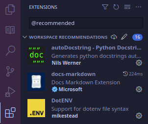
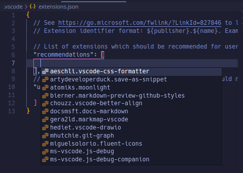
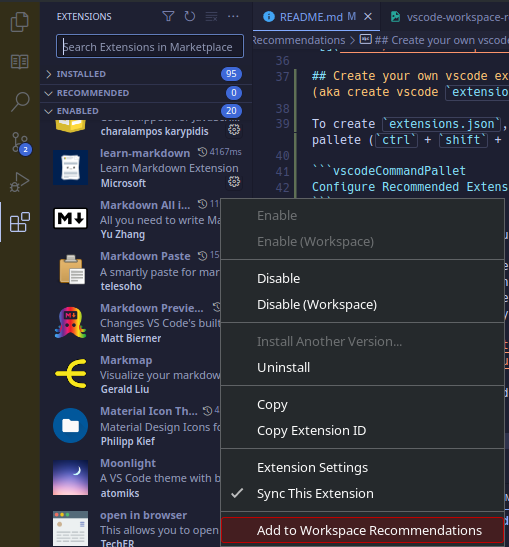

# VSCode Workspace Extensions Recommendations
This repository contains the collection of my extension lists while coding in [Visual Studio Code](https://code.visualstudio.com/) (aka vscode). The lists are created based on the technology I used for development.

## The Repository Structure
The extensions list is grouped by its prgramming language. Inside of those folders contains the technologies/frameworks that are used. Here is the structure of this repository in the tree view:

<pre>
.
└── programming-languages
    └── technology/framework
        └── <b>extensions.json</b>
</pre>

For example, if you want to see [djangorestframework](https://www.django-rest-framework.org) extensions recommendation you can go to this path:

<pre>
.
└── python
    └── djangorestframework
        └── <b>extensions.json</b>
</pre>


## How to add the list as your workspace recomendation?
You can place `extensions.json` into your `.vscode` folder inside your root project directory.

<pre>
./root-project-directory
└── .vscode
    └── <b>extensions.json</b>
</pre>

Then, you can see the recommended extensions list by typing `@recommended` into the search bar on the extensions panel. See the screenshot below:

  

## Create your own vscode extensions recommendation list (aka create vscode `extensions.json` file)

To create `extensions.json`, you need to run this command pallete (`ctrl` + `shift` + `P`):

```vscodeCommandPallet
Configure Recommended Extensions (Workspace Folder)
```

This will brought you to your new `extensions.json` file.

### Adding recommended extensions

You can add recommended extensions using `ctrl` + `I` while placing your cursor inside recommendations-square-brackets (`[]`). It'll show the list of extensions installed on your local machine. Then, press enter to add the extension to the recommendation list

  

Or you can add the recommended extensions using extensions manager.

  

click on `Add to Workspace Recommendations` context menu to add the extension to the recommendation list.

### Adding unrecommended (unwanted recommendation) extensions
You can add unrecommended extensions just like adding the recommended extensions. But this time, you will add the extension showed by pressing `ctrl` + `I` inside unwantedRecommendations-square-brackets (`[]`).

---

Copyright © 2023 garasijogi

Licensed under the [MIT](LICENSE) license.
